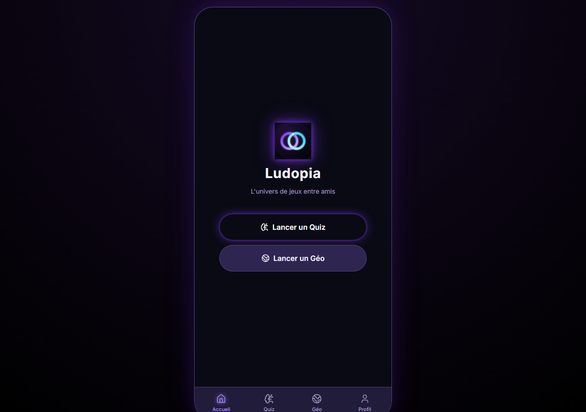
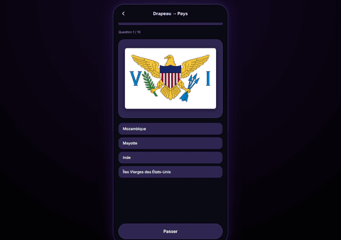

# Ludopia

<p align="center">
  
</p>

L'univers de jeux entre amis, jouable à plusieurs sur un même appareil : un mode Quiz par cartes et un mode Géographie dédié (drapeaux, capitales, silhouettes de pays) aujourd'hui, d'autres familles de jeux à venir. Application web installable (PWA), en français.

<p align="center">
  
  
</p>

## Fonctionnalités

- **Mode Quiz** : 2 à 6 joueurs, cartes tirées parmi 6 catégories (Géographie, Divertissement, Histoire, Art & Littérature, Sciences & Nature, Sport & Loisirs) avec catégorie/difficulté cachées jusqu'au retournement, questions adaptées à 3 niveaux d'âge (Enfant / Ado / Adulte).
- **Mode Géographie** : quiz dédiés — Drapeau → Pays, Pays → Capitale, Capitale → Pays, Pays → Forme — ou un Défi chrono mélangeant toutes les questions contre la montre.
- **Classement** : les scores des modes Quiz et Géographie sont enregistrés avec le nom du joueur et classés par meilleur score.
- **Profil personnalisable** : nom par défaut, niveau d'âge par défaut, préférences de quiz Géo (nombre de questions, durée), sons, vibrations, anti-veille pendant une partie, installation en PWA.
- **Hors-ligne** : l'application est installable et fonctionne sans connexion grâce à son service worker (vite-plugin-pwa).

## Stack technique

- [React 19](https://react.dev/) + [TypeScript](https://www.typescriptlang.org/) + [Vite](https://vite.dev/)
- [Zustand](https://github.com/pmndrs/zustand) pour l'état applicatif (parties persistées en `localStorage`)
- [Tailwind CSS v4](https://tailwindcss.com/) pour le style
- [Framer Motion](https://www.framer.com/motion/) pour les transitions et animations
- [react-simple-maps](https://www.react-simple-maps.io/) / [d3-geo](https://github.com/d3/d3-geo) pour les silhouettes de pays
- [Vitest](https://vitest.dev/) + Testing Library pour les tests
- [Oxlint](https://oxc.rs/) pour le lint

## Installation

```bash
npm install
```

## Lancer le projet

```bash
npm run dev       # serveur de développement (http://localhost:5173)
npm run build      # build de production dans dist/
npm run preview   # prévisualiser le build de production
```

## Tests et lint

```bash
npm run test        # tests unitaires (vitest)
npm run test:watch  # tests en mode watch
npm run lint         # lint (oxlint)
```

## Structure du projet

```
src/
  components/   # composants réutilisables (UI, quiz, quiz Géo, questions)
  routes/       # écrans de l'application (un par route)
  store/        # état global (quiz, quiz Géo, profil) via Zustand
  domain/       # logique métier pure (sélection de questions, génération de quiz)
  data/         # banques de questions
  types/        # types TypeScript partagés
public/
  data/         # données géographiques (pays, silhouettes)
  flags/        # drapeaux SVG
scripts/        # scripts de génération de données/icônes
```

## Licence

Distribué sous licence [MIT](LICENSE).
